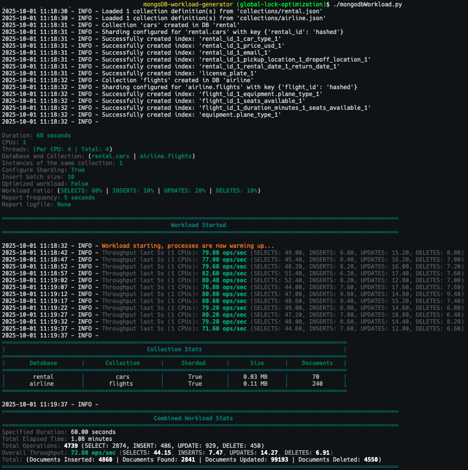
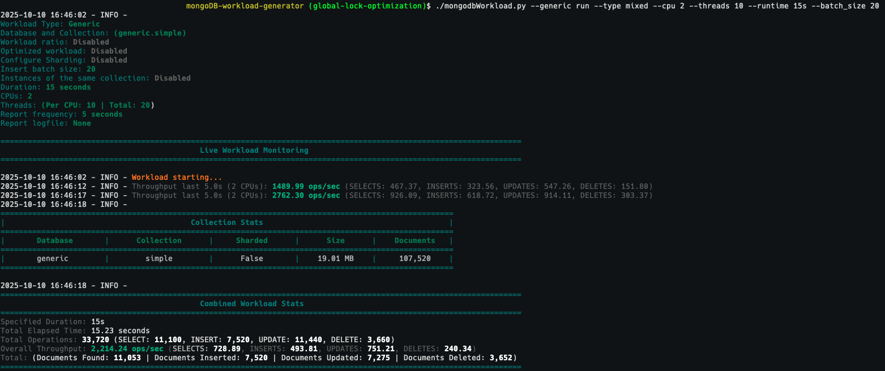

# Workload Generator for MongoDB

## Overview
The Workload Generator for MongoDB is a powerful tool designed to help users effortlessly generate data and simulate workloads against both sharded and non-sharded MongoDB clusters. The tool supports all standard CRUD (Create, Read, Update, Delete) operations, allowing for the creation of realistic performance tests that reflect real-world usage patterns.

## Key Features
Realistic Workload Simulation: By default, the generator creates a mixed workload of all CRUD operations based on common usage scenarios. For more targeted testing, it allows users to define custom queries to run against the generated collections, providing a high degree of flexibility.

Ease of Use: While offering extensive configuration capabilities, the tool requires minimal setup. It is user-friendly, requires no compilation, and only needs basic MongoDB connection details to get started.

High-Performance Load Generation: The tool is optimized to leverage multiple CPU cores and a configurable number of threads on the host system. This high level of parallelism makes it ideal for generating large-scale workloads and conducting effective stress tests on MongoDB clusters. The more resources available on the host machine, the greater the potential load that can be generated.

## A Unique Approach to Benchmarking
Unlike typical benchmarking utilities, the Workload Generator for MongoDB functions as a highly customized application simulator. While standard benchmarking tools are designed for comparing different databases with generic workloads, this tool's greatest strength is its ability to mimic specific application behavior. Using JSON files, users can define not just data shapes and indexes but also complex, multi-step custom queries.

This makes it the ideal solution for:

* Simulating an application's exact workload to test database performance under realistic conditions.
* Validating schema changes and their impact on performance.
* Fine-tuning indexes for specific query patterns.

Additionally, the tool includes a "generic" mode for simpler use cases. This mode functions more like a standard benchmark tool, allowing users to quickly measure the raw performance of find, update, delete, and insert operations without needing to configure a custom workload.

## System Requirements
The application was developed and tested using Python 3, which is the recommended version for optimal compatibility. Modifications to the scripts may be necessary to support older Python versions if upgrading is not feasible.

#### Pre-reqs

Workload Generator for MongoDB relies on a few additional Python libraries that are not installed by default. To ensure proper functionality, please install the following dependencies:

- [faker](https://pypi.org/project/Faker/) – Used to generate random fictional data, ideal for bootstrapping databases, stress testing, and creating randomized datasets.
- [pymongo](https://www.mongodb.com/docs/languages/python/pymongo-driver/current/) – Library for interacting with MongoDB using Python.
- [motor](https://motor.readthedocs.io/en/stable/) - Motor: Asynchronous Python driver for MongoDB

Make sure you have Python 3.11 installed, then make it the default version (or use a virtual env)

```
sudo dnf install python3.11 python3.11-pip -y
```

Install the above libraries, run the following command:

```
pip3 install faker pymongo motor
```


## Configuration

The tool consists of many modules, however only 1 requires modification and others are optional: 

* [mongodbCreds.py](mongodbCreds.py) -- Configure you connection details
* [customProvider.py](customProvider.py) -- Create custom providers (optional)

2 sample collections and 2 query templates have also been provided, they each have their own dedicated folders:

[collections](collections) -- Collection Definitions

* [collections/airline.json](collections/airline.json)
* [collections/rental.json](collections/rental.json)

[queries](queries) -- Query Definitions:

* [queries/airline.json](queries/airline.json)
* [queries/rental.json](queries/rental.json)

The only configuration required in order to be able to start using the workload generator is in [mongodbCreds.py](mongodbCreds.py), where you define the connection details for your  cluster. The file is self-explanatory and includes examples to help you set up your environment correctly. You may also extend this file to include additional parameters as needed.

All other files do not require any sort of configuration, the tool has a pre-definined set of queries that are randomly generated (these are found in [mongodbLoadQueries.py](mongodbLoadQueries.py)) which you can extend if you wish to do so. 


## Functionality

By default, the workload runs for 60 seconds, utilizing 4 threads and a single CPU core. It scans the collections directory for JSON files (i.e., collection definitions) and creates the corresponding databases and collections accordingly.

The tool includes two sample collection definition files. When executed with the default settings, it creates two databases—airline and rental—each containing one collection: flights and cars, respectively. These collections are populated with sample documents similar to the example shown below.

Query generation is handled automatically using templates defined in [./mongodbLoadQueries.py](mongodbLoadQueries.py). During workload execution, the tool randomly selects from these templates to simulate a full range of CRUD operations.

Note: Sharding is enabled by default when using the sample collection definitions located in the collections directory. To disable this behavior, either remove the shardConfig section from the JSON files or supply custom collection definitions (see below for details).


`airline.flights`

```
[direct: mongos] airline> db.flights.findOne()
{
    _id: ObjectId('685b235e686cbe204c4d531b'),
    flight_id: 8861,
    first_name: 'Ashley',
    last_name: 'Mitchell',
    email: 'pwilliams@example.org',
    flight_date: ISODate('1992-02-14T18:26:33.701Z'),
    origin: 'North Joshuafort',
    destination: 'West Cole',
    flight_code: 'FLT-639',
    duration_minutes: 2588,
    gate: 'U2',
    equipment: {
      plane_type: 'ERJ-145',
      total_seats: 50,
      amenities: [ 'WiFi', 'TV', 'Power outlets' ]
    },
    seats_available: 11,
    passengers: [
      {
        passenger_id: 1,
        name: 'Scott Phillips',
        seat_number: '2C',
        ticket_number: 'YHQ4UG8M4F'
      },
      {
        passenger_id: 2,
        name: 'Christina Lewis',
        seat_number: '11F',
        ticket_number: '4YV9MW3RQT'
      },
      {
        passenger_id: 3,
        name: 'Alexis Roberts',
        seat_number: '15E',
        ticket_number: 'BMSWKUCTM9'
      },
.... removed for brevity .....
```

`rental.cars`

```
[direct: mongos] rental> db.cars.findOne()
{
  _id: ObjectId('685da56886e3e52b504a6e90'),
  rental_id: 5320,
  first_name: 'Hannah',
  last_name: 'Foster',
  email: 'paulamccann@example.org',
  rental_info: {
    rental_date: ISODate('2025-06-18T03:25:10.048Z'),
    return_date: ISODate('2025-06-27T03:25:10.048Z'),
    pickup_location: 'Lake Mary',
    drop_off_location: 'West Larry'
  },
  car_type: 'Pickup',
  license_plate: 'WQI-6371',
  price_usd: 4004.63,
  options: {
    gps: false,
    child_seat: true,
    extra_driver: false,
    insurance: 'basic'
  },
  drivers: [
    {
      driver_id: 1,
      name: 'Pamela Burgess',
      age: 67,
      license_number: 'MUJ5PLWCT8',
      license_state: 'ID'
    },
    {
      driver_id: 2,
      name: 'Francisco Chan',
      age: 29,
      license_number: 'GOEQOKRMVH',
      license_state: 'HI'
    }
  ]
}
```

The default query distribution ratio is as follows:

* 60% SELECT queries
* 20% UPDATE queries
* 10% INSERT queries
* 10% DELETE queries

This default distribution provides a balanced and meaningful baseline for performance testing and stress simulations. However, users are encouraged to adjust these ratios to better align with their specific use cases and workload characteristics.

During execution, the tool generates a real-time report every 5 seconds, showing the average number of queries executed across all utilized CPU cores, along with a detailed breakdown by operation type. At the end of the run, a final summary report is produced, providing statistics on overall workload performance and collection activity ([see sample output below](#Basic-Usage)).


## Customization

Workload generator comes pre-configured with 2 collections and 2 query definitions:

Collections:

* [collections/airline.json](collections/airline.json)
* [collections/rental.json](collections/rental.json)

Queries:

* [queries/airline.json](queries/airline.json)
* [queries/rental.json](queries/rental.json)


When the tool starts, it automatically searches for collection definition files in the collections folder and generates queries at random. You can create your own collection definition files (in JSON format) and place them in the collections folder. Similarly, you can add custom query definition files (also in JSON format) to the queries folder. In order to use the queries from the `queries` folder you must provide the `--custom_queries` option.

If you prefer to organize your custom collections and queries in different directories you can do so—just be sure to specify their locations when running the tool, as it defaults to searching in the collections and queries folders if you don't.

To use custom collection definitions and queries from the default folders, simply provide the following parameters:

```
--collection_definition --custom_queries
```

To load files from custom locations supply the full paths, as shown in the example below. This will load all files found in those folders:

```
--collection_definition /tmp/collections --custom_queries /tmp/queries
```

**NOTE**: When using your own custom queries the `--optimized` parameter is ignored, since you control how your queries are written. You can either write optimized, ineffective queries or both. You can also create separate query definition files with optimized queries and ineffective queries, the use case is your choice.

Random Workload (when you call the workload without passing `--custom_queries`): When you don't provide a custom query file, you can use the `--optimized` flag to tell the application whether to generate efficient queries (like updateOne, deleteOne, count_documents) or a mix of efficient and less efficient ones (like updateMany, deleteMany, find).

Custom Workload (when you call the workload with `--custom_queries`): When you provide your own JSON query file, you have full control. The script executes the exact command specified in the "operation" field of each query object in your file. The `--optimized` flag is completely ignored.

## Usage

The workload is highly configurable at runtime, enabling you to fine-tune its behavior by specifying various parameters during execution. These parameters allow you to control key aspects of the workload, including workload duration, number of threads, query distribution, and more.

By default, the tool generates a predefined and pre-configured database and collection as explained above. However, you can optionally provide custom collection definition and query files as explained above. When used in combination, these options offer a high degree of flexibility, allowing you to adapt the application's behavior to meet your specific requirements and simulate operations that more accurately represent your target workload.

#### Getting help

You can obtain help and a list of all available parameters by running `./mongodbWorkload.py --help` 

```
./mongodbWorkload.py --help
usage: mongodbWorkload.py [-h] [--generic] [--custom_queries CUSTOM_QUERIES] [--collection_definition COLLECTION_DEFINITION] [--collections COLLECTIONS] [--recreate] [--optimized]
                          [--insert_ratio INSERT_RATIO] [--select_ratio SELECT_RATIO] [--update_ratio UPDATE_RATIO] [--delete_ratio DELETE_RATIO] [--skip_insert] [--skip_select]
                          [--skip_update] [--skip_delete] [--db DB] [--collection COLLECTION] [--num_docs NUM_DOCS] [--type {find,update,delete,insert,mixed}] [--runtime RUNTIME]
                          [--threads THREADS] [--cpu CPU] [--batch_size BATCH_SIZE] [--report_interval REPORT_INTERVAL] [--log LOG] [--debug]
                          [{prepare,run,cleanup}]

MongoDB Workload Generator

options:
  -h, --help            show this help message and exit
  --generic             Run the high-throughput generic point-query workload.
  --runtime RUNTIME     The total duration to run the workload (e.g., 60s, 5m). Default: 60s
  --threads THREADS     Number of threads (coroutines) per process. Default: 4
  --cpu CPU             Number of CPUs/processes to use. Default: 1
  --batch_size BATCH_SIZE
                        Number of documents to insert in each batch. Default: 100
  --report_interval REPORT_INTERVAL
                        Frequency (in seconds) to report operations per second. Default: 5
  --log LOG             Path and filename for log output.
  --debug               Enable debug mode to show detailed output.

Default and Custom Workload Options:
  --custom_queries CUSTOM_QUERIES
                        Path to a JSON file with custom queries.
  --collection_definition COLLECTION_DEFINITION
                        Path to a JSON file or directory with collection definitions.
  --collections COLLECTIONS
                        Number of collections to use. Default: 1
  --recreate            Drops the collections before starting the workload.
  --optimized           Use more efficient queries (i.e. 'find_one', 'update_one', 'delete_one').
  --insert_ratio INSERT_RATIO
                        Workload ratio for insert operations.
  --select_ratio SELECT_RATIO
                        Workload ratio for select operations.
  --update_ratio UPDATE_RATIO
                        Workload ratio for update operations.
  --delete_ratio DELETE_RATIO
                        Workload ratio for delete operations.
  --skip_insert         Skip all insert operations.
  --skip_select         Skip all select operations.
  --skip_update         Skip all update operations.
  --skip_delete         Skip all delete operations.

Generic Workload Options ONLY (used with --generic):
  {prepare,run,cleanup}
                        The command for the generic workload: 'prepare', 'run', or 'cleanup'.
  --db DB               Database name for the generic workload. Default: generic
  --collection COLLECTION
                        Collection name for the generic workload. Default: simple
  --num_docs NUM_DOCS   Number of documents for the 'prepare' step. Default: 100000
  --type {find,update,delete,insert,mixed}
                        The type of generic workload to run: find, update, delete, insert, or mixed. Default: find
```                        

#### Basic Usage 

Once you have configured the settings to match your environment, you can run the workload without specifying any parameters. This will utilize the default settings, providing a great way to familiarize yourself with the tool and review its output. The default setting is not optimized, this means it will randomly choose between optimized and innefective queries, so your performance may vary and this can be quite slow:



#### Advanced Usage

You have a wide range of options available, and the parameters are neither exclusive nor mutually dependent, allowing you to use as many or as few as needed.
The parameters available and their use cases are shown below:

1. collections -- Number of collections

  - The workload will create multiple instances of the same collection when you specify `--collections` with the desired number of collections, for example: `--collections 5`. Each collection will have its index count appended to its name, such as `flights_1`, `flights_2`, `flights_3`, and so on. You can create additional collections even after the initial workload has been run. For example, if you run the first workload with `--collections 5` and then run a new workload with `--collections 6`, a new collection will be created and the workload will run against all 6 of them.


2. collection_definition -- Collection structure

  - You can provide your own custom collection definition file in JSON format, following the provided examples found in the [collections](collections) folder. The collections from this folder are the default collections used by the workload if you do not provide your own. 
  
  - You can create your own JSON file and place it in the `collections` folder or anywhere else in your file system. If you place the JSON file in the `collections` folder, all you need to do is pass the file name, e.g: `--collection_definition my_custom_definition.json`. However, if you store the JSON in a different folder, then you have to provide the entire path, e.g.: `--collection_definition /tmp/my_custom_definition.json`. You can create as many collections as you would like, you just need to create separate collection defintion files and place them in the same folder.

  - It is recommended for ease of use to place your custom collection definitions in the [collections](collections) folder.

  - In addition to the standard and self explained parameters in the provided JSON files, you can also specify an option called "provider". This is the faker provider used to generate each specific random datatype. I have created custom [faker providers](https://faker.readthedocs.io/en/master/#providers) that are used by the JSON files included with the tool, their definition is available in [customProvider.py](./customProvider.py). Feel free to look at those and [create new ones if you'd like](https://faker.readthedocs.io/en/master/#how-to-create-a-provider) or use any of the many [faker providers](https://faker.readthedocs.io/en/master/#providers) available if you would like to further extend the tools functionality.

  - The collection definition file is where you configure the following:
    - database name
    - collection name
    - fields
    - sharding
    - indexes

  - Sample behavior summary:
    * No input (default behavior)	When `--collection_definition` is omitted	-- Loads all .json from [collections](collections)
    * `--collection_definition airline.json` - Loads collections/airline.json
    * `--collection_definition /tmp/custom/airline.json` - 	Loads from full path
    * `--collection_definition ./alt_defs/airline.json` - Loads from relative path
    * `--collection_definition /nonexistent/path` -	Fails with error
    * `--collection_definition /tmp/mycollections`	- (Directory path) Loads all .json files in that directory

3. recreate -- Recreating collections

  - If you want to start from scratch you can pass `--recreate` and this will drop and recreate everything for you based on the parameters you provide. 

4. optimized -- Optimized Workload
  
  - By default, this setting is disabled, allowing the workload to run all queries—including both optimized and inefficient ones. To execute a more performance-focused workload, use the `--optimized` flag when running the tool.

    When enabled, this mode ensures that queries utilize the primary key and appropriate indexes, instead of using random fields that may or may not have indexes or other less efficient patterns. Using this option significantly enhances the workload's performance and efficiency.

    Additionally, enabling this flag restricts find workloads to aggregate queries only, minimizing the overhead of transferring large volumes of data from the database to the client.

    This option is automatically ignored if you provide your own queries via `--custom_queries`.

5. runtime -- How long to run the workload

  - You can specify how long to run the workload. This is done in secods or minutes, e.g: `--runtime 5m`

6. batch_size -- Batch size

  - The workload performs its inserts in batches of 10 documents. You can change this behavior with a new batch size, e.g: `--batch_size 20`

7. threads -- Number of threads

  - By default, the workload tool uses 4 threads. You can adjust this by specifying a different thread count using the --threads parameter (e.g., `--threads 12`).

    This setting controls how many threads the client—i.e., the workload tool—will start. Increasing the number of threads allows for more concurrent operations, thereby generating greater load on the database server.

    Note: This setting affects only the client (the workload tool) and does not modify any server-side configurations.

8. Skipping certain workloads

  - You can configure the tool to skip certain workloads by using any of the following (these can be used in combination if needed):
    - `--skip_update`         
    - `--skip_delete`         
    - `--skip_insert`        
    - `--skip_select`   

9. Query ratio

  - You can configure the default query ratio to suit your needs. For example, to run 90% SELECT statements instead of the default, use: `--select_ratio 90`. The workload will automatically distribute the remaining 10% across the other query types according to the original query ratio. The available options with example settings are:

    - `--insert_ratio 20`
    - `--update_ratio 30`
    - `--delete_ratio 15`
    - `--select_ratio 35`

10. CPUs

  - This setting determines how many CPU cores are used by the workload on the client machine, directly affecting the amount of load generated against the backend MongoDB cluster. 
    
    By default, the workload runs using a single CPU core (based on the local CPU count). Naturally, increasing the number of CPUs allows the tool to generate more concurrent operations, resulting in higher load on the database server.
    
    You can specify the number of CPUs to use via the --cpu parameter (e.g., `--cpu 10`). If the specified number exceeds the available CPU cores on the system, the workload will automatically adjust to use the maximum number of available cores.
    
    When used in combination with the thread configuration, this setting enables high levels of parallelism and can significantly increase the load on the MongoDB cluster.
  
    Note: This setting affects only the client (the workload tool) and does not modify server-side configurations.

11. Report interval (seconds)

  - You can configure the report interval from the default 5s, e.g: `--report_interval 1`

12. Record the workload report to a log

  - You can configure the workload to log its output to a file. While the workload will continue to stream its output to the terminal, a log file will also be created for additional analysis, should you choose to enable this option. e.g: `--log /tmp/report.log`

13. Configure custom query templates

  - You can customize the workload by adding or removing queries in the [mongodbLoadQueries.py](mongodbLoadQueries.py) file to suit your specific requirements. The file includes a mix of optimized and intentionally inefficient queries to help simulate various workloads. The queries created by this file are randomly generated based on the collection definitions.

    During execution, the tool randomly selects between aggregation queries (e.g., `collection.count_documents(query)`) and select queries (e.g., `collection.find(query, projection)`), choosing from both optimized and inefficient options. If you prefer to use only optimized queries, you can enable the `--optimize` flag, which excludes inefficient queries from the workload.

    Note: The query definitions in this file are structured as templates, enabling the tool to dynamically execute queries against any custom collection. If you choose to modify this file, ensure that you follow the same structure to maintain compatibility with the workload tool.

14. Create custom queries

  - You have the ability to create your own queries, enabling the workload to run exactly the same queries as your application. In order to do this you just need to create your own JSON query definition files and add them to the `queries` folder.

  - The tool comes with 2 sample query definition files that can be used when the configuration `--custom_queries` is provided. If you provide this option alone (without specifying a file name or path), the tool will automatically randomly generate queries based on all query definition files present in the `queries` folder.  

  - The query definition files are in JSON format and 2 examples have been provided, so you can build your own custom queries to match your specific use case (make sure you follow the same syntax as provided in the examples).

  - You can use standard or custom datatypes in your query json files (see queries/arilines.json and queries/rental.json for examples):
   * `<pk>` -- This will guarantee the query uses an existing random primary key value for the given collection (instead of a dynamic random value)
   * `<int>`,`<double>`,`<string>` ... etc -- This will use the standard datatypes
   * `<gate>`,`<car_type>`,`<email>`,`<city>` ... -- These are custom data types you have created and added to customProvider.py or available via the faker library 

  - You can also store your custom queries in a separate folder, however you will need to pass the path, and this will randomly generate queries based on all the files in that folder: `--custom_queries /tmp/custom_query_folder` 

15. Combine sharded and non-sharded collections in the same workload

  - You can create both sharded and non-sharded collections by following this workflow:
    1. Create a sharded workload by editing the JSON file accordingly and configuring the `shardConfig` parameter (see provided JSON for exmaple)
    2. Create another workload without configuring sharding in the JSON file (remove the `shardConfig` parameter), but increase the number of collections using `--collections` option (make sure the number specified is higher than the current number of collections). For example, if you have 1 collection, you can use `--collections 2` and this would create 1 new collection that's not sharded.

    The above workflow will utilize the existing sharded collections while creating new collections as non-sharded, since the sharding configuration was not provided, but the number of collections was increased with `--collections`.

16. Debug

  - You can run the tool in debug mode by providing the `--debug` argument to see more details about your workload and if you wish to troubleshoot query issues.

#### Generic Workload Usage 

The Generic Workload is a simplified, high-throughput benchmarking mode designed for raw performance and stress testing. Unlike the "Standard" or "Custom" modes (explained above) that simulate complex application behavior, the Generic Workload focuses on a single task: executing simple point-queries as fast as possible.

This mode is ideal for answering the fundamental question: "How fast can my MongoDB cluster retrieve individual documents?" It removes the complexity of custom schemas and workload mixes, allowing you to measure the baseline performance of your hardware and database configuration.

##### The Three-Step Workflow
The Generic Workload operates using a simple, three-command lifecycle: `prepare`, `run`, and `cleanup`.

* prepare: This command creates a dedicated benchmark collection and populates it with a specified number of simple documents. Each document contains only a unique _id and a random payload, optimized for fast insertion and querying.

* run: This is the core performance test. The script pre-fetches a sample of values from the prepared collection and then uses all available CPU cores and threads to hammer the database with queries for a specified duration.

* cleanup: This command safely drops the benchmark collection, cleaning up the database environment after your test is complete.

##### Usage and Commands
To use this mode, you must include the `--generic` flag followed by one of the three commands (`prepare`, `run`, or `cleanup`).

1. Prepare the Dataset
This example creates the `generic.simple` collection (or as specified) with 100 thousand documents.

```
./mongodbWorkload.py --generic prepare --num_docs 100000
```

2. Run the Workload
This example executes a 60-second performance test using 4 CPU processes and 100 threads per process.

```
./mongodbWorkload.py --generic run --runtime 60s --cpu 4 --threads 100
```

3. Clean Up the Dataset
This command drops the `generic.simple` collection.

```
./mongodbWorkload.py --generic cleanup
```

##### Generic Workload Options

* `--generic prepare|run|cleanup`	Required. Activates the generic workload mode and which action to perform: `prepare, run, or cleanup`.
* `--db`	Optional. The name of the database to create. Default: `generic`
* `--collection`	Optional.	The name of the collection to create. Default: `simple`
* `--num_docs`	Optional.	The number of documents to create during the prepare step. Default: `100000`
* `--type find|update|delete|insert|mixed` Optional. You can specify the type of workload when using the `run` action. Default: `find`

###### Additional Options

While the Generic Workload has unique commands (prepare, run, cleanup) and specific options (e.g., `--num_docs`), it also shares several general-purpose flags with the Standard and Custom modes. These allow you to control the execution and intensity of the test, including options such as:

By default, the run command executes a high-throughput, read-only (find_one) point-query test. However, this behavior can be customized to include a mix of operations. The following options allow you to precisely tailor the workload to your testing needs:

* `--cpu` 
* `--threads` 
* `--runtime`  
* `--batch_size`

###### Sample Generic Workload

